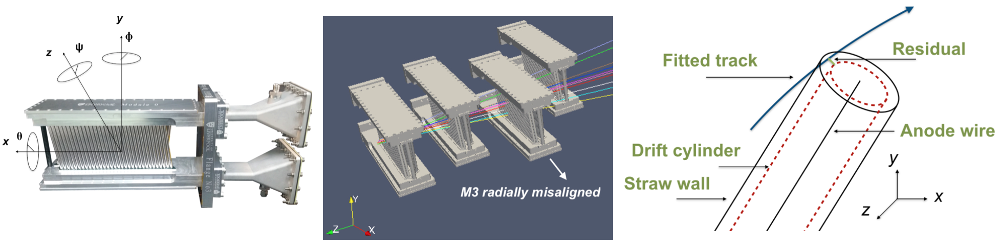
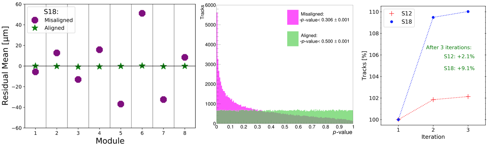
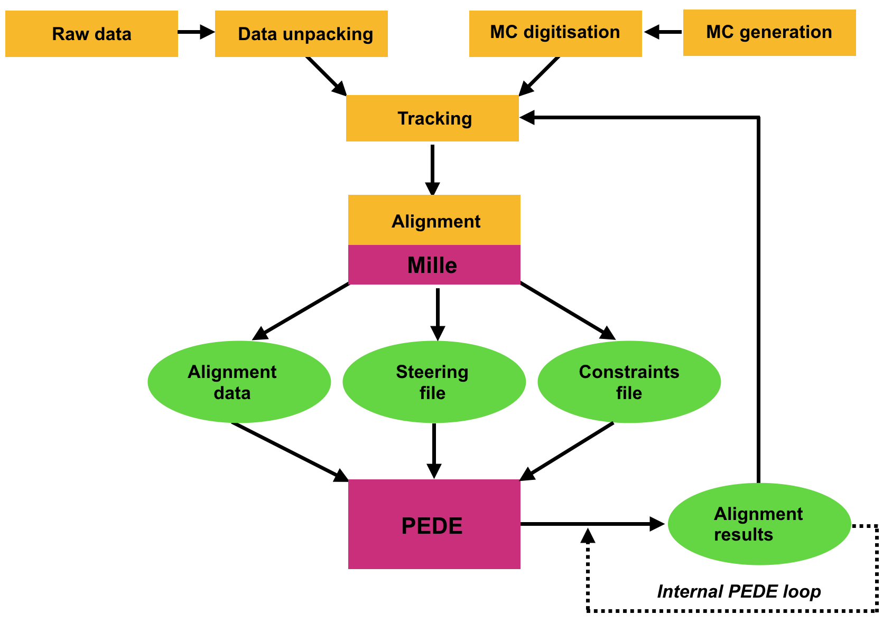

# alignTrack
#### This project contains code and plotting scripts for the internal alignment (calibration) of the g-2 tracking detector.

A misalignment of a tracking detector results in a residual between a hit position (i.e. measurement) and a fitted track (i.e. prediction). This residual arises from the fact that the assumed detector position, which was used in the fitting of the track, is not the actual position of that detector. The alignment procedure aims to establish the corrections (i.e. calibration) to the assumed detector position, and hence, minimise the residuals. This minimisation of the residuals is a statistical problem, involving the optimisation of the p-values (i.e. track quality) of fitted tracks in data.

#### Results demonstrating the performance of the alignment procedure (in simulation) are shown below:

For a well-aligned (calibrated) detector, the mean value of residuals are at zero, the p-value distribution of the fitted tracks is uniform, and more data is reconstructed (i.e. increased yield):

* **This work led to a publication (arXiv:1909.12900): <a href=https://arxiv.org/pdf/1909.12900.pdf target="_blank"> https://arxiv.org/pdf/1909.12900.pdf</a>, where alignment results with data are discussed.**
* **The analysis of data from the now-calibrated (aligned) detector is continued in https://github.com/glukicov/EDMTracking**
* The alignment procedure and alignment monitoring, including writing the derived calibration constants to the production database (PSQL), are detailed in [the alignment manual (link)](http://gm2-docdb.fnal.gov/cgi-bin/RetrieveFile?docid=9857&filename=manual.pdf&version=16)

Alignment flow
============

Project structure
============
1. mpIIDESY/ - main directory for C++ Tracker MC code, and pede. 
2. PEDE/ - up-to-date clean version of pede from DESY svn: http://svnsrv.desy.de/public/MillepedeII/tags/V04-06-00
2. C_mpIIDESY/ - for experimenting with toy C++ model MC and pede.
4. F_mpIIDESY/ - for experimenting with toy Fortran model MC and pede.
5. python_toy_tracker/ - John's python code for toy tracker

#### Legacy code up to v1.0 is mainted here
#### The official release is now maintained on Fermilab's redmine repository: https://cdcvs.fnal.gov/redmine/projects/gm2tracker/wiki/Tracker_Alignment_MC_with_Millipede_II_Framework

Installation (to verify the alignment routines)
============
To get the code (requires c++0x compiler suport for the Logger) working on gm2gpvm0x at Fermilab:
The utilised version of PEDE is V04-03-08 (up-to-date with DESY as of 5 Dec 2017).
Makefiles detect the OS (SL Linux or Mac Unix) and use the right compiler automatically.

    git clone https://github.com/glukicov/alignTrack.git #to get the latest code from our repository 
    cd alignTrack/mpIIDESY
    make #to build the pede executable 
    pede -t # test that it works (should give a terminal output like below [i.e. last 2 lines]): Millepede II-P ending   ... Mon Dec 12 12:31:15 2016  Peak dynamic memory allocation:    0.100512 GB
    ./getRandoms.sh 100000  # see description below (!)

### Random (Integer) Number Generation ###
To generate random numbers:
   
    ./getRandoms.sh x y # where x is the number of tracks the MC will be run for, and y is a seed. This bash script calls:
    python randomIntGenerator.py -u True -o uniform_ran.txt -s y -n x*4
    python randomIntGenerator.py -g True -o gaussian_ran.txt -s y -n x*16 
to produce the correct number of random numbers for the requested number of tracks. 
 
### Running C++ MC AlignTracker: ###
1. Compile code with `make -f AlignTracker.mk` (supports ROOT5/6, Logger from gm2trackedaq, and RandomNumberBuffer)
`make -f AlignTracker.mk clean` - also removes previusly generated data, steering and constrain files - can be useful]
2. Generate data by running `./AlignTracker n x y z` (where x is the number of tracks to generate, y and z are the offsets [keep 0.0 0.0 for intial runs!]) for normal or `./AlignTracker d x y z` for debug/verbose output, or `./AlignTracker p x y z` for plotting with reduced statistics (to see individual tracks) All options generate:

   * `Tracker_data.bin`, `Tracker_con.txt`, `Tracker_str.txt`, `Tracker_par.txt`  [data, constrains, steering, pre-sigma files]
   * `Tracker.root` [sanity plots]
3. Align the detector by running `./pede Tracker_str.txt`.
The `d` and `p` options produce additional debug files: Tracker_d_*.txt or Tracker_p_*.txt, respecivelly. 
AlignTracker.cpp (contains definition of purpose) - main programme calling on methods from AlignTracker_methods.cpp. 

### Producing PEDE Histograms
    root readPedeHists.C+ # will display all PEDE histograms in canvases

alternatively:

    root
    root [0] .L readPedeHists.C+
    root [2] readPedeHists() # [possible options inisde () "write" "nodraw" "print"] 
The rootlogon.C file takes care of over/undeflows, sig.fig., etc.

#### PYTHON ANALYIS SCRIPTS ####

##### Comparing True, Fitted Parameter Values #####
1. Ensure Python use is enabled.
2. Generate test data, using either Fortran or C++ programme. This will generate a file containing true parameter values, for example `mp2test1_true_params_c.txt`.
3. Fit data using `./pede str.txt`. This will generate a results file `millepede.res`.
4. Run python script to compare parameter values, using `python compareParams.py -f <pede results file> -t <true parameter values file>`

##### Constraint Comparison #####
`compareConstraints.py` is designed to carry out fits of *Test 1* C++ data, varying the constraints used by `pede` for fitting. Just ensure *Test 1* is properly built, with the binary `MpTest1` available, then run the script. A plot of the differences between fitted and true plane displacements, against the parameter label for each plane displacement, will be shown, with one series for each set of constraints applied in the fit.

##### Reading Parameters Into Root #####
Two python scripts are supplied to read parameter values into a Root `TTree` - `readCParamsToRoot.py`, and `readFortranParamsToRoot.py`. These both generate `mille` data, then carry out `pede` fits using different fitting methods. Parameter values, and associated uncertainties (if available), are output in a `TTree`, with a number indexing the fitting routine used (true parameter values are denoted with `0`). These Root files are used for subsequent analysis.

##### Comparing Labelled Parameter Values #####
`compareLabelsRoot.py` creates various comparison plots between true and fitted parameter values. By default, parameters found by the inversion `pede` method are examined. Parameters must be read into a Root file using the scripts above, then the script is used as: `python compareLabelsRoot.py -i <input_file>`.

##### Comparing C++, Fortran Parameter Values #####
`compareCppFortranFits.py` creates similar plots to above, with two series - one for values found with the C++ version of *Test 1*, and one for those found with the Fortran version. Parameter values are also output in the console as a table. Two Root files must be created using the scripts above, which are then used with the script using: `python compareCppFortranFits.py -c <C++_Root_file> -f <Fortran_Root_file>`.

##### Examining Alignment Matrix Eigenvectors #####
Weak modes of alignment (overall detector shifts, shears *etc.*) may be examined by diagonalising the alignment matrix, and examining its eigenvectors. This can be done using `pede` and the `eigenSpectrumAnalysis.py`, as follows:

1. Generate `mille` data using `MpTest1` binary.
2.  Modify output steering file so that `pede` will use diagonalisation.
   * Set so that the line `method diagonalization` is the last method shown in the steering file.
3. Run `pede` using the modified steering file. A file of eigenvectors (`millepede.eve`) will be produced.
4. Run script using `python eigenSpectrumAnalysis.py -i <eigenvector_file> -o <output_directory>`

This script will plot the eigenspectrum for the matrix, showing the eigenvalue associated to each eigenvector. It will also plot values for each alignment parameter in each eigenvector, showing plane displacements and drift velocity deviations separately. All plots are output as `.pdf` files in the specified directory. Eigenvectors with low eigenvalues correspond to weak modes of alignment. Applying proper constraints should suppress these weak modes.
